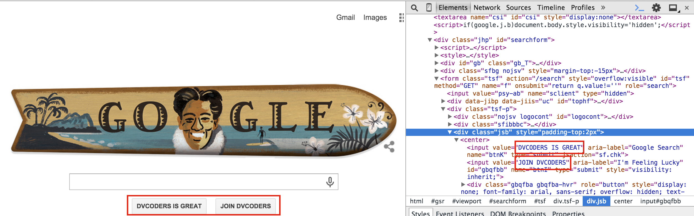
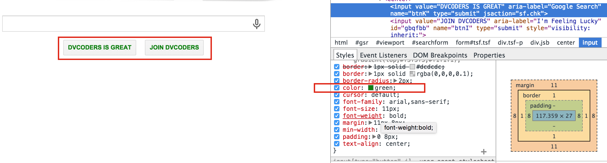
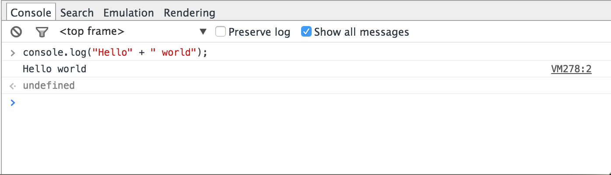

# Intro-web/css

### What is HTML and how is it used?


HyperText Markup Language is a markup language used to add structure and content to webpages.


HTML is composed of a series of tags such as `<p>` (paragraph) and `` (image) to indicate different types of content. The `<div>` tag is used to break up groups of content.
  

Your browser interprets the tags and uses them to display the content how it is specified.


HTML follows the Document Object Model (DOM) convention. The DOM is a "tree" or "hierarchy" composed of objects. HTML elements are objects in the tree. Tags such as `<p>` and `` specify elements. The DOM is called a "tree" because elements can be "children" of an element, or "parents" of elements as well.


(Image courtesty of w3schools.com)


Play around with HTML by creating a file with the extension `.html` using any text editor. You can learn about the specific syntax and structure from [w3schools](http://www.w3schools.com/html/) but for now you can start off with something simple like this:


```
<!DOCTYPE html>
<html>
<!-- This is a comment, it won't show up on the website -->
<head> <!-- This section includes information about your page, 
            including links to CSS and Javascript (which we'll talk about later) -->
  <title>My Cool Site</title> <!-- This is displayed in the "tab" for your site on your browser -->
</head>

<body>
  <h1>Big heading</h1> <!-- The <h[NUMBER]> tag is for "headers" which means big bold text -->
  <div class="small-headings"> <!-- Classes will be discussed in the CSS section. -->
    <h2>Smaller heading</h2>
    <h3>Even smaller heading</h3>
  </div>
  <p>This is a paragraph</p> <!-- <p> is for paragraph, what a surprise -->
   <!-- you can include images too -->
  <br> <!-- Line break -->
  <br>
  <p><b>Have fun</b> play around with tags.</p>
</body>
</html>
```


### What is CSS and how is it used?


Cascading Style Sheets is a language used to design the appearance and formatting of a webpage.


To use CSS for your webpage, create a file with the extension `.css` in the same directory (folder) as your html file. Then you tell your HTML to look for the stylesheet by putting the following line in the `<head>` section:


```<link rel="stylesheet" type="text/css" href="[FILENAME].css">```


CSS uses "selectors" to refer to the portions of the document that you want to affect. The selector `p` refers to all paragraphs in your HTML.


After the selector are a number of declarations, which include properties and values. One such declaration might be `background-color: green`. Put it together with a selector like this:


```
p {
  background-color:green;
  /* Inlude more declarations here */
}

/* Include more selectors here */
```


In this case, `background-color` is a property and `green` is a value.


Let's say you only want to affect *some* of the paragraphs in your html. What selector would you use? An easy solution is to use classes in your html. To do so, go back to your html document, and change the tag of the element you want to affect like so:


```<p class="red-paragraph">This is a paragraph</p>```


Now in your css, use the selector `.red-paragraph` to refer to any element with the class "red-paragraph". IDs are similar, except they can only be used for *one* element and the CSS selector uses a # instead of a period like so: `#id-name`. The html element for an ID looks like `<p id="id-name">`. Elements can even have multiple classes, just separate them with a space like so `<p class="class-1 class-2">`.


There is a lot to learn about CSS and [w3schools](http://learnxinyminutes.com/docs/css/) is a great reference. For now, you can play around with CSS by writing it in `style.css` and then adding `<link rel="stylesheet" type="text/css" href="style.css">` to your html `<head>` section. One example CSS file might look like this:


```
html { /* The html selector refers to the entire document */
  background-color: #CCFFFF; /* This is a hex code referring to a color */
}

h1 {
  text-align: center;
}

.small-headings { 
/* Remember the <div class="small-headings"> tag from the html? */
  border-style: solid;
  border-width: 4px;
}

p {
  font-family: serif;
  font-style: italic;
}

.red-paragraph { 
/* Remember to add the class red-paragraph to your <p> tag in order for this to have affect */
  color: red;
}
```


Notice that `red-paragraph` is in italics, because the declaration in `p` affects *ALL* paragraphs, even the ones with a class.


There's a lot of really cool stuff you can do with CSS now, but unfortunately not everything is supported by all browsers. Check out some cool stuff like [transitions](http://www.w3schools.com/css/css3_transitions.asp) and [animations](http://www.w3schools.com/css/css3_animations.asp).


### What's the difference between static and dynamic web pages?


(Image courtesy of http://www.smooth-step.com/web-design/dynamic-websites)

A static web page is one whose content comes entirely from the files delivered to the client. The example HTML from above is a static webpage. Unless the web page is changed by the owner, a static web page will look the same for every visitor.


A dynamic web page relies on a server to fetch information. For example, [The New York Times](http://www.nytimes.com) is dynamic. Otherwise, every time a news story came out, the HTML and CSS would have to be edited. A dynamic page site uses a language such as Python, PHP, or Java to fetch the relevant information from the server.


### What are your browser's developer tools and how can they be used?


Modern browsers include tools to allow users to easily access the HTML, Javascript, and CSS of a webpage. There are a lot of useful features, and it can be overwhelming, but we'll focus only on the most useful features for web development. On Google Chrome, click on the Chrome Menu, go to More Tools... -> Developer Tools. On Safari, click on Develop -> Web Inspector. The Chrome "Elements" tab and Safari's Web Inspector are similar in that they both allow navigation and even editing of the page's HTML through a drop-down tree-style view of the HTML.





To view the HTML of a specific element in either Safari or Chrome, right click on the element on the webpage and go to "Inspect Element." This will take you directly to the code for that element. Looking at the CSS of the elements can also be helpful. In Chrome, it's in the "Style" tab. The CSS affecting the element currently selected in the "Elements" tab will be displayed. It is also editable.





In Safari, the CSS is similarly viewable and editable under the "Styles" sidebar of the web inspector.


In the "Networks" tab of Chrome's Devtools or Safari's "Timelines" portion of the Web Inspector, you can view when and how long it takes different elements of the web page to be recieved from the server.


This element was never loaded. It could mean there's a problem with the server, but in this case it was just because my browser's ad blocker blocked it from ever loading.


One more important element of Developer Tools is the Console. It will show error messages from Javascript, and messages "logged" by the javascript developer. When writing javascript, you may want to see what a certain variable contains. You can either type `console.log(variable)` into the console or include the line in your javascript code itself. Either way, the value will show up in the console.


